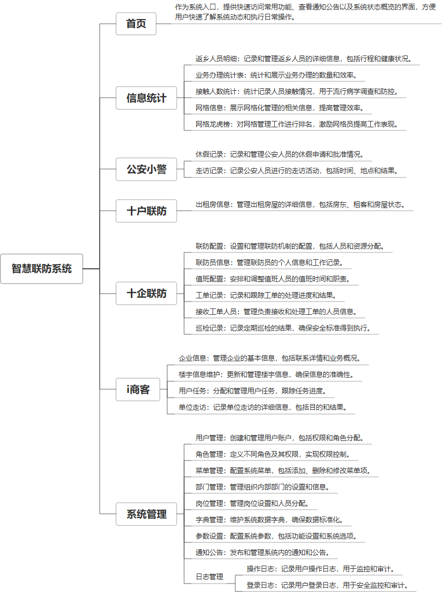

 

    
 

公司拥有上百套具有自主知识产权的软件系统，详情请查看码云首页或公司官网

 
<h1>智慧联防系统</h1>

<a href="https://www.haishi.net.cn/">公司官网</a> ｜ <a href="https://www.haishi.net.cn/">在线体验</a>

 

## 系统介绍

智慧联防系统是一款集成了多种功能模块的综合信息处理平台，它涵盖了休假记录、联防配置、值班配置、巡检与工单记录、出租房信息管理、归属地管理、单位走访、企业信息维护、用户与角色管理、部门与岗位管理、字典与参数设置等全方位的联防管理需求。
智慧联防系统是一款集成了多种功能模块的综合信息处理平台，它涵盖了休假记录、联防配置、值班配置、巡检与工单记录、出租房信息管理、归属地管理、单位走访、企业信息维护、用户与角色管理、部门与岗位管理、字典与参数设置等全方位的联防管理需求。
本项目名称为智慧联防系统，旨在构建一个信息化、智能化的社会治安防控体系。该系统通过整合公安、社区、企业等多方资源，实现信息共享、协同联防，提升社会治安防控能力。系统主要面向公安部门、社区网格员、企业联防员等用户，提供信息统计、警务管理、联防配置、出租房管理、企业信息管理等功能。
本项目包含以下终端：
- Web端：公安部门、社区网格员等用户使用，进行信息统计、警务管理、联防配置等操作。
- 移动端（推测）：可能存在移动端应用，供联防员、企业员工等使用，方便信息上报、任务接收等。
                

## 系统功能介绍

### 系统包含终端说明

管理端（WEB）

| 序号 | 模块 | 模块说明 |
| --- | --- | --- |
| 1 | QHY-CRM-CMC-MANAGE | 管理端 |
| 2 | QHY-CRM-CMC-SERVER | 服务端 |

### 系统功能结构

### 系统功能说明

主要功能：
- 信息统计：提供返乡人员明细、业务办理统计、接触人数统计、网格信息、网格龙虎榜等数据统计功能，为治安防控提供数据支撑。
- 公安小警：提供休假记录、走访记录、归属地管理等功能，方便公安部门进行警务管理。
- 十企联防：提供联防配置、联防员信息、值班配置、工单记录、接收工单人员、巡检记录等功能，实现企业联防的规范化管理。
- 十户联防：提供出租房信息、归属地管理等功能，加强对出租房屋的管理，消除安全隐患。
- I商客：提供企业信息、楼宇信息维护、用户任务、单位走访等功能，服务于企业用户。
其他功能：
- 登录系统
- 用户管理
- 角色管理
- 菜单管理
- 部门管理

## 系统主要界面

## 系统技术说明

### 代码模块说明

| 序号 | 目录 | 目录说明 |
| --- | --- | --- |
| 1 | QHY-CRM-CMC-SERVER/cmcc-platform-admin | -- |
| 2 | QHY-CRM-CMC-SERVER/cmcc-platform-framework | -- |
| 3 | QHY-CRM-CMC-SERVER/cmcc-platform-quartz | -- |
| 4 | QHY-CRM-CMC-SERVER/cmcc-platform-system | -- |
| 5 | QHY-CRM-CMC-SERVER/cmcc-platform-common | -- |
| 6 | QHY-CRM-CMC-SERVER/cmcc-platform-generator | -- |

### 系统技术选型

#### 开发语言/框架

JAVA（JDK1.8）

#### 服务中间件

Nginx
Tomcat

#### 数据库

MySQL（5.7+）

#### 其他说明

无

## 系统演示/商用

请扫码添加客服微信获取演示地址和系统详细资料。

如果您想基于智慧联防系统进行商业化交付或定制开发服务，我们提供有偿的技术服务支持，合作模式不限，欢迎沟通！

公司官网地址： <a href="https://www.haishi.net.cn/">https://www.haishi.net.cn</a>

联系客服获取专业回答。

## 使用须知

1、 本项目商用必须获得版权所有者的授权。

2、 未经允许本项目代码不允许二次出售。

